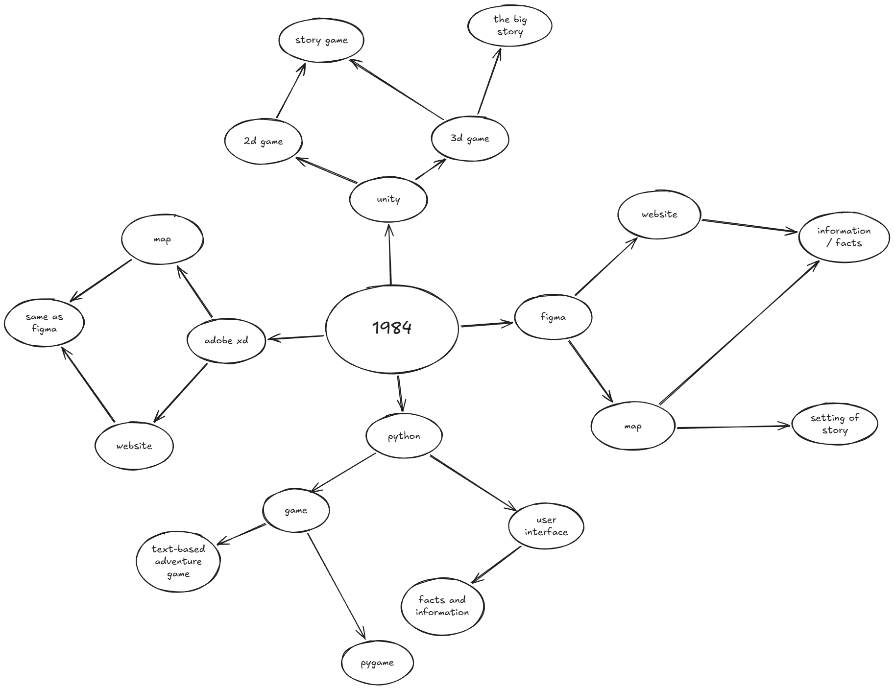

# UX Design Project Documentation
### Fraser Maple

## Project Proposal

### Design Brief
I plan to create an interactive digital map based on the setting of the book *1984* by George Orwell, targeted towards people who want to read or have read the book.

### Book Choice and Justification
The book I have chosen for my user experience design project is *1984* by George Orwell. *1984* details a dystopian society where the citizens are constantly monitored by the government, and where individual thought is forbidden. I chose this book because it has a very fleshed out setting which lends itself perfectly to what I want to create.

### User Experience Type
I plan to create an interactive digital map of the world in which *1984* takes place. The user will be able to click on the different nations on the map and be provided with information about that nation. This map will give the user a better understanding of the setting of the story, allowing the user to be further immersed in the novel and to enjoy it more thoroughly.

### Target Market
The target audience of my user experience are people who wish to read/are reading/have read George Orwell's *1984*. While the novel contains some mature themes not suitable for young children, my user experience should be suitable for most ages and reading levels due to its primarily graphic nature. My user experience will appeal to the target audience because it will provide a deeper insight on the novel while being interactive and engaging. I will cater to my target audience by keeping my map true to the book, providing accurate information which will give the user a deeper understanding of the book.

### Software and Tools
I plan to use a user experience prototyping software such as Figma or Adobe XD as they will allow me to create a working prototype of my user experience without needing to go through the trouble of learning how to create a website for it.

### Initial Brainstorming

Of the different branches on this mindmap, the most feasable and effective options would be Adobe XD and Figma as they 

## Requirements Specification

### Functional Requirements

**Purpose of the Application**

Describe what the app will do (e.g., "The app will allow users to explore book characters through interactive profiles").
My application will allow users to explore the setting of *1984* and to read information

Explain whether the app is designed to promote the book or engage fans within its genre.

**Use Cases**

Identify at least four key user interactions (e.g., "Users will select a character to view their backstory" or "Users can participate in a genre-themed quiz").

Include a brief user journey for each use case, explaining how users will navigate the app.

1. User will click an area of the map to see more information.
2. From an information page the user can click to go back to the map.

**Test Cases**

Outline expected behaviours of the user experience (e.g., "When the user selects 'Start Quiz,' the app will display the first question").

Describe how you will test these features later (e.g., peer testing or self-testing).

Provide at least four examples 

1. When the user clicks on a region of the map, it will take the user to a page which provides more information about that region. This feature can be self-tested and peer tested to ensure it functions correctly.

2. On the page with i

### Non-Functional Requirements

**Performance**

Describe how the app will deliver smooth, responsive interactions (e.g., "Navigation between screens will occur within one second").

**Usability**

Identify design choices to make the app easy to use (e.g., consistent layout, accessible font sizes).

**Reliability**

Explain how they will ensure the app is consistent and bug-free (e.g., testing across different devices or screen sizes).

**Security**

Outline any privacy considerations if the app collects user data (e.g., login systems or user feedback forms).